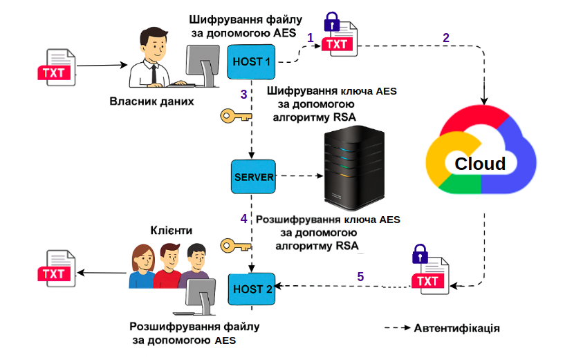
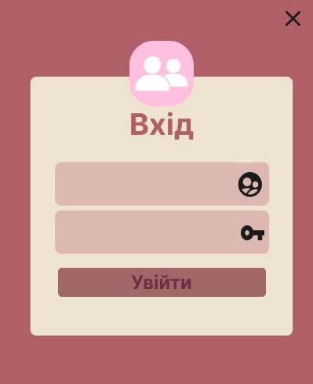
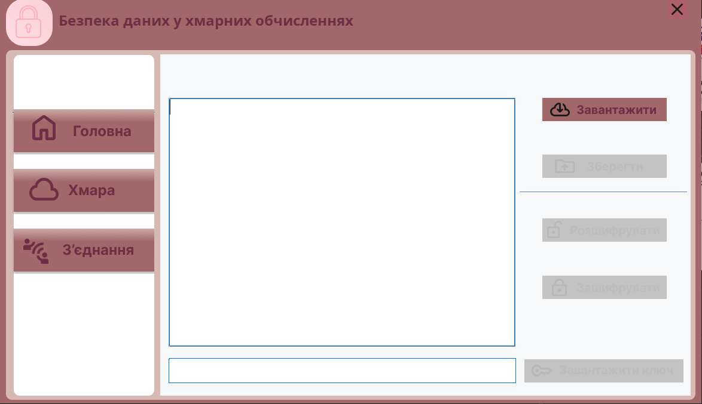
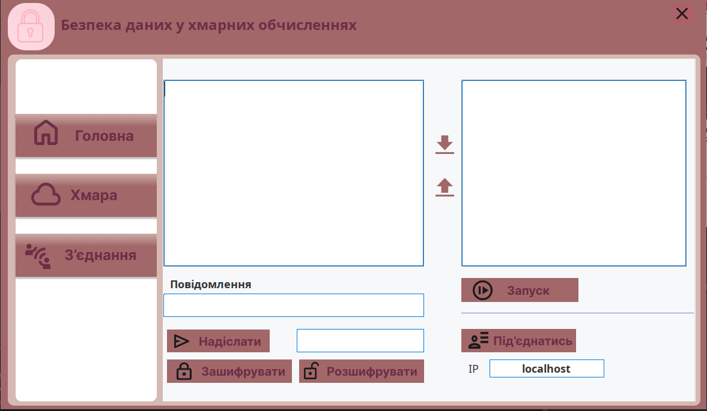

# Безпека даних у хмарних обчисленнях

## Архітектура проєкту

## Програма

Додаток на основі архітектури клієнт-сервер(Архітектура вище)
щоб зашифрувати дані, що проходять через Хмару.
Використовується, з одного боку, алгоритм симетричного шифрування AES,
а з іншого боку, алгоритм асиметричного шифрування RSA
для ключів.

###	Вхід

### Домашнє вікно

### Хмарне вікно

### Вікно для з'єднання

